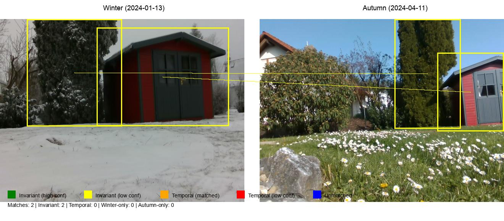

# Cross-Temporal Landmark Matching Pipeline

Vision-language pipeline for matching landmarks across seasonal datasets using FastVLM and OWL-ViT. Identifies invariant landmarks and temporal changes in outdoor environments captured under different conditions (winter vs autumn).

**Project Documentation:** [Google Docs](https://docs.google.com/document/d/1B7olGH20mLg_vbxM9kXPgtVxORdQn5aJza6HhdTuOmo/edit?usp=sharing)

## Overview

The pipeline implements an efficient hierarchical matching system with intelligent preprocessing to handle large-scale datasets (50k+ images):

### Pipeline Stages

**Stage 0: Keyframe Selection (Preprocessing)**
- Efficient frame filtering using classical computer vision (color histograms)
- Reduces computational load by selecting only visually distinct frames
- ~100x faster than deep learning-based approaches
- Processes frames in HSV color space for robustness to lighting changes

**Stage 1: Image Stream Ingestion**
- Pairs corresponding frames from winter/autumn datasets
- Filters macOS resource fork files automatically

**Stage 2: Open-Vocabulary Detection**
- OWL-ViT detects objects using natural language queries
- Supports focused queries for outdoor landmarks and adaptive thresholding

**Stage 3: Semantic Enrichment**
- FastVLM generates descriptions and visual embeddings
- Creates rich semantic representations for matching

**Stage 4: Depth Validation**
- Validates matches using depth consistency
- Distinguishes permanent structures from temporal objects

**Stage 5: Geometric Verification**
- Keypoint matching (ORB/SIFT) with RANSAC
- Provides spatial verification of semantic matches

**Stage 6: Visualization**
- Color-coded comparisons (green=invariant, yellow=low-confidence invariant, orange=temporal match, red=low-confidence temporal, blue=unmatched)
- Side-by-side frame comparisons with annotated bounding boxes

**Stage 7: Semantic Segmentation**
- (Stretch goal) Pixel-level change detection

## Example Output



*Example showing landmark matching between winter (2024-01-13) and autumn (2024-04-11) scenes. Yellow boxes indicate invariant landmarks (permanent structures), orange boxes show matched temporal objects, and blue boxes are unmatched detections. The pipeline successfully identifies the red shed as an invariant landmark despite seasonal appearance changes.*

## Quick Start

```bash
# Activate environment
conda activate fastvlm

# Run pipeline with all optimizations (recommended for large datasets)
python cross_temporal_pipeline.py \
    --winter-rgb /Volumes/KAUSAR/rover_dataset/2024-01-13/realsense_D435i/rgb \
    --winter-depth /Volumes/KAUSAR/rover_dataset/2024-01-13/realsense_D435i/depth \
    --autumn-rgb /Volumes/KAUSAR/rover_dataset/2024-04-11/realsense_D435i/rgb \
    --autumn-depth /Volumes/KAUSAR/rover_dataset/2024-04-11/realsense_D435i/depth \
    --model-path checkpoints/llava-fastvithd_0.5b_stage2 \
    --output-dir pipeline_results \
    --use-keyframing \
    --adaptive-thresholds \
    --focused-queries \
    --max-pairs 10

# Run without keyframing (for small datasets or when all frames are needed)
python cross_temporal_pipeline.py \
    --winter-rgb /path/to/winter/rgb \
    --autumn-rgb /path/to/autumn/rgb \
    --model-path checkpoints/llava-fastvithd_0.5b_stage2 \
    --output-dir pipeline_results \
    --max-pairs 10
```

### Key Command-Line Options

- `--use-keyframing`: Enable efficient frame filtering using color histograms (recommended for 1000+ images)
- `--adaptive-thresholds`: Adjust detection thresholds based on scene complexity
- `--focused-queries`: Use domain-specific queries for outdoor landmarks (buildings, signs, poles)
- `--max-pairs N`: Limit processing to N frame pairs (useful for testing)
- `--detection-threshold X`: Set OWL-ViT confidence threshold (default: 0.3)

## Output

Results are saved to `pipeline_results/`:
- `visualizations/` - Side-by-side frame comparisons with annotated matches
- `data/landmark_matches.json` - Structured match data with confidence scores
- `crops/` - Cropped detection regions for inspection

## Architecture

**Detection Models:**
- OWL-ViT (`google/owlvit-base-patch32`) for open-vocabulary object detection
- FastVLM (`llava-fastvithd_0.5b_stage2`) for semantic understanding

**Keyframing Strategy:**
- Classical CV approach using 3D color histograms (HSV space, 8×8×8 bins)
- Frame similarity via histogram correlation (OpenCV `compareHist`)
- Frames selected when correlation drops below 0.95 threshold
- ~100x faster than embedding-based approaches, no caching needed
- Ideal for large datasets (50k+ images) where processing every frame is infeasible

**Matching Strategy:**
- **Embedding similarity**: Cosine distance on FastVLM visual features
- **Semantic similarity**: Text-based keyword matching on object descriptions
- **Depth consistency**: 3D spatial validation using depth maps
- **Geometric confidence**: Keypoint matching (ORB/SIFT) with RANSAC verification

**Classification:**
- **Invariant landmarks**: Permanent structures (buildings, signs, poles) - high depth consistency
- **Temporal objects**: Seasonal changes (trees, vegetation, vehicles) - lower depth consistency

## Datasets

- [ROVER](https://iis-esslingen.github.io/rover/pages/dataset_overview/) - Multi-seasonal outdoor navigation
- [FourSeasons](https://cvg.cit.tum.de/data/datasets/4seasons-dataset/download) - Long-term visual localization

## Dependencies

Core requirements:
- PyTorch 2.0+
- Transformers (Hugging Face)
- FastVLM (llava)
- OpenCV
- Pillow, NumPy, scikit-learn

See `pyproject.toml` for full dependencies.

## Notes

- The pipeline filters out macOS resource fork files (`._*`) automatically
- Supports MPS (Apple Silicon), CUDA, and CPU backends
- Keyframing uses a hardcoded correlation threshold of 0.95 (optimized for outdoor scenes)
- Detection threshold (default 0.3) can be adjusted via `--detection-threshold`
- Depth images are optional but significantly improve match quality and invariant/temporal classification
- For datasets with 50k+ images, `--use-keyframing` can reduce processing time by 10-100x

## Performance Considerations

**Keyframing Efficiency:**
- Without keyframing: ~5-10 seconds per frame pair (50k images = ~70-140 hours)
- With keyframing: Processes only visually distinct frames (~500-1000 from 50k images)
- Keyframe selection overhead: ~0.01 seconds per image (50k images = ~8 minutes)
- Total speedup: 10-100x depending on scene repetition

**Memory Requirements:**
- Base pipeline: ~4-6 GB GPU memory (FastVLM 0.5B model)
- Larger models (1.5B, 7B): 8-24 GB GPU memory
- Keyframing adds negligible memory overhead (histograms are small)

## Evaluation Framework

To rigorously assess the pipeline's effectiveness, we propose a controlled comparison against two baseline methods. This evaluation isolates the contribution of multi-modal fusion by using identical detection inputs across all methods.

### Experimental Design

**Controlled Detection (Stages 1-2):**
All methods use identical OWL-ViT detections with the same queries and confidence threshold. This ensures fair comparison by providing the same candidate bounding boxes to each approach.

Implementation:
1. Run detection once and save raw outputs (bounding boxes, labels, scores) to `detections.json`
2. Load these identical detections for all three methods during matching

**Differentiated Matching (Stages 3-5):**
After obtaining identical bounding boxes, each method applies different matching strategies:

| Method | Matching Approach | Stages Used |
|--------|------------------|-------------|
| **Baseline A** (Embedding-only) | FastVLM visual embeddings + cosine similarity | Stage 3 only |
| **Baseline B** (Geometric-only) | ORB/SIFT keypoint matching within bounding boxes | Stage 5 only |
| **Full Pipeline** (Ours) | Multi-modal fusion: embedding + semantic + depth + geometric | Stages 3-5 |

### Research Questions

#### RQ1: Multi-Modal Fusion Value
**Question:** Does combining multiple cues (embedding + semantic + depth + geometric) produce higher-quality matches than single-cue approaches?

**Metrics:**
- Average final confidence score
- Percentage of high-confidence matches (>0.7)
- Geometric inlier counts across methods

**Expected Finding:** Full pipeline should have higher average confidence and more geometric inliers, demonstrating that multi-modal fusion filters out ambiguous matches.

---

#### RQ2: Geometric vs. Semantic Reliability
**Question:** Which is more reliable for cross-temporal matching—geometric features (keypoints) or semantic features (embeddings)?

**Metrics:**
- Total number of matches found per method
- Distribution of confidence scores
- Qualitative analysis of failure cases

**Expected Finding:** Geometric matching likely produces fewer but higher-precision matches, while embedding matching finds more candidates but with lower precision. The full pipeline combines both strengths.

---

#### RQ3: Hierarchical Filtering Effectiveness
**Question:** Does the hierarchical progression from broad (embedding) to precise (geometric) verification successfully filter out false positives?

**Metrics:**
- Track candidate pairs passing each stage (embedding → semantic → depth → geometric)
- Analyze the "funnel" effect from initial similarity to final verification

**Expected Finding:** Many pairs have high embedding similarity, but only a subset also have high geometric consistency—demonstrating why hierarchical filtering matters.

---

#### RQ4: Invariant vs. Temporal Classification
**Question:** Can depth consistency distinguish permanent structures from seasonal/temporary objects?

**Metrics:**
- Average depth consistency for matches labeled "invariant" vs. "temporal"
- Statistical separation between categories (t-test or KS-test)

**Expected Finding:** Invariant landmarks should cluster at high depth consistency (>0.8), while temporal objects show lower consistency. Baseline A cannot make this distinction.

---

#### RQ5: Robustness to Appearance Change
**Question:** How well does each method handle challenging seasonal appearance changes (snow, foliage, lighting)?

**Metrics:**
- Manually identify 10-15 "challenging" frame pairs with extreme appearance differences
- Compare success rates (% of correct matches) across methods

**Expected Finding:** 
- Embedding-only fails on visually similar but distinct objects (e.g., two trees with similar foliage)
- Geometric-only fails when texture changes drastically (snow covering features)
- Full pipeline succeeds by requiring agreement across modalities

